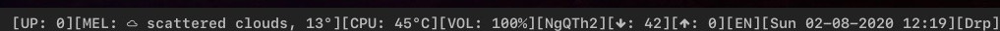

My dwm_bar config
=================
This is forked from [https://github.com/joestandring/dwm-bar](https://github.com/joestandring/dwm-bar). I have added a few functions for my bar.

## The modules on show are:
1. Arch update
2. Current weather (change the location in the file, please add your openweatherMap API code in the file to use it)
3. CPU temp
4. Volume control (show current level and mute)
5. Network name
6. UP and DOWN speed (in packets)
7. Keyboard language (ibus in this case)
8. Time
9. Show if Dropbox is running
